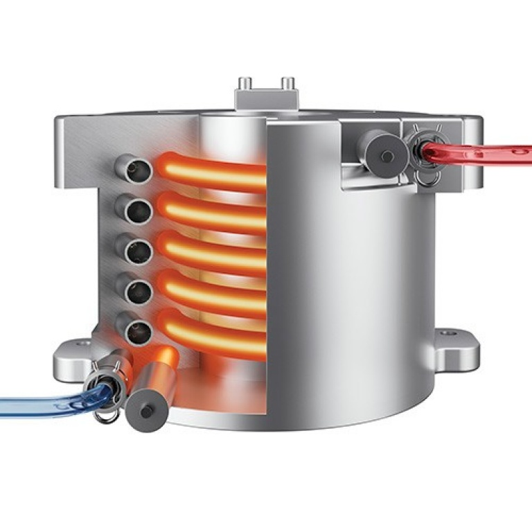
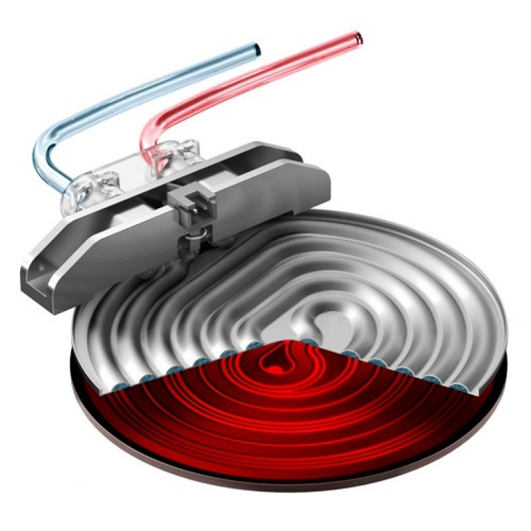

### Breville thermoblocks vs thermojets

Disclaimer: this is written given data and observations; it has not been confirmed by Breville technical support.

Breville machines with the exception of the BDB and Oracle series use either a thermojet or a thermoblock to heat water for pulling a shot, steaming, or hot water output.

Newer Breville models are powered by thermojets, and older by thermoblocks:

Thermoblock
  - Duo Temp Pro (BES810BSSUSC, US version)
  - Infuser (BES840XL)
  - Barista Express (BES870XL)

Thermojet
  - Bambino (BES450BSS1BUS1, US verison)
  - Bambino Plus (BES500BTR1BUS1, US verison)
  - Barista Pro (BES878)
  - Barista Touch (BES880)

It seems like a reasonable assumption that Breville is looking to outfit all of their espresso machines outside of the Dual Boiler and Oracle with a thermojet going forward (based off model numbers and release dates). The thermojet takes up less space, heats up faster, and is more efficient from a power usage perspective.

Thermoblock | Thermojet
 | 

Both the jet and block work by using heating elements in close proximity to water flow to bring the water up to temperature. The temperature control happens with sensors on either the block/jet material temp or the water line itself (unclear) used in a closed loop to control power to the heating element. The block is built in to the grouphead and sits right below the surface of the case, so ambient heat from the heating elements can reach the portafilter/basket when locked in and any cups on top of the machine. I (PWEB) have never taken apart a thermojet machine, but it is probably located in a similar position. 

One critical difference is when the two systems are active; the thermoblock heats the block up to the desired brew temperature so the water running through it gets brought up to temp as it flows through the coils within. This means you will have a large aluminum block constantly being heated whenever the machine is powered on. The jet is only actively heating during a shot, hot water, or steaming. The heating elements bring the water up to temp during a shot given their position relative to the water flow. The jet heating elements can come up to temp in 3 seconds or so, and the block reaches its desired temp in about 30 sec. The key takeaway is the thermojet system cannot heat your PF/basket once the machine is turned on. You can flush hot water a few times through to get it warm, but just letting everything sit for awhile will not heat up the PF. This is the opposite of a thermoblock, which will heat the entire system for you once you hit the power button. The block is heated in 30 sec, but it takes around 10 min for the PF to come up to a reasonable shot temp via the ambient heat from the block.

